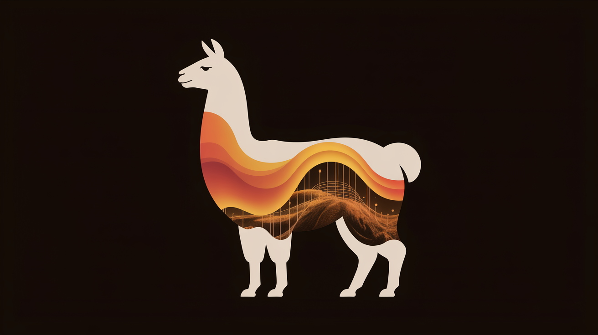

# 🦙 Ollama-Menu (v4.0 SOTA 2026)

<div align="center">



**The Ultimate Cross-Platform AI Model Selector, Hardware VRAM Optimizer & Interactive Launcher for Ollama**

[](https://opensource.org/licenses/MIT)
[]()
[](https://ollama.com)
[](https://jtgsystems.com)

*Browse, filter, optimize, and launch over **350+ local open-source LLMs** with real-time VRAM fit evaluation and 1-click execution.*

</div>

---

## 🌟 New in v4.0 (2026 SOTA Release)

- 🧠 **Deep Reasoning Models**: Integrated `deepseek-r1` (1.5B to 70B), `phi4:14b`, and `marco-o1`.
- 💻 **Elite Coding Models**: Integrated `qwen2.5-coder` (7B, 14B, 32B), `deepseek-coder-v2:16b`, and `granite-code:8b`.
- 🚀 **Flagship Open Weights**: Integrated `llama3.3:70b`, `llama3.2` (1B/3B), `qwen2.5` (7B/14B/32B/72B), `gemma2`, and `mistral-small`.
- 👁️ **Vision & Multimodal**: Integrated `llama3.2-vision` (11B/90B), `minicpm-v:8b`, and `llava:13b`.
- ⚡ **Cross-Platform**: Full native support for **Linux**, **macOS**, and **Windows** with Rich TUI, Bash, and Batch launchers.
- 🎛️ **Hardware VRAM Fit Evaluation**: Real-time detection of NVIDIA VRAM, AMD ROCm VRAM, Apple Unified Memory, and System RAM to prevent out-of-memory crashes before launching.

---

## 🚀 Quick Start & Installation

### Option 1: Global CLI / Python (Linux, macOS, Windows)
```bash
git clone https://github.com/jtgsystems/Ollama-Menu.git
cd Ollama-Menu
pip install -e .

# Launch Interactive Menu:
ollama-menu
# or short alias:
om
```

### Option 2: Linux & macOS One-Liner
```bash
./ollama-menu.sh
```

### Option 3: Windows Batch Launcher
Double-click `ollama-menu.bat` or run:
```cmd
ollama-menu.bat
```

---

## ⌨️ CLI Commands

```bash
# Launch interactive categorized model browser
ollama-menu

# Search model directory by keyword (e.g., reasoning, coder, vision, 14b)
ollama-menu search reasoning

# Run any model directly
ollama-menu run deepseek-r1:8b

# List installed local models
ollama-menu list

# Batch update all installed local models
ollama-menu update
```

---

## 📊 Hardware Sizing & VRAM Recommendations

| Model Class | Parameters | Minimum VRAM (Q4) | Target Hardware Profile |
| :--- | :--- | :--- | :--- |
| **Edge / Ultra-Light** | `1B - 3B` | **1.5 GB - 3 GB** | Laptops, Raspberry Pi 5, CPU-only systems |
| **Daily Driver** | `7B - 9B` | **5.5 GB - 7 GB** | RTX 3060/4060 (8GB VRAM), Apple M1/M2/M3 (16GB) |
| **High Intelligence** | `14B - 16B` | **10 GB - 12 GB** | RTX 3080/4070 (12GB VRAM), Apple M2/M3 (24GB) |
| **Heavy Reasoning / Code** | `27B - 35B` | **18 GB - 22 GB** | RTX 3090/4090 (24GB VRAM), Apple Studio (32GB+) |
| **Frontier Open-Weight** | `70B - 72B` | **42 GB - 48 GB** | Dual RTX 3090/4090, Apple Studio 64GB/128GB |

---

## 🏆 Created by JTG Systems

<div align="center">

<a href="https://jtgsystems.com">
  
</a>

**Engineered with pride by [JTG Systems](https://jtgsystems.com)**  
*Enterprise Systems Architecture, Custom Workstations & AI Solutions*

🌐 **Website**: [jtgsystems.com](https://jtgsystems.com)  
📞 **Contact**: (905) 892-4555  
☕ **Tips & Sponsorship**: `jtgsystems@gmail.com`

</div>

---

## 🔍 SEO Keyword Cloud & Search Tags

<details>
<summary><strong>Expand Search Engine Index & Compatibility Keywords</strong></summary>

### 🏷️ Search Queries & Tags:
`ollama menu` · `ollama model selector` · `ollama batch script windows` · `ollama linux menu launcher` · `local ai model launcher` · `deepseek-r1 ollama runner` · `qwen2.5-coder local setup` · `llama 3.3 70b local inference` · `ollama vram fit calculator` · `best local ai models 2026` · `run uncensored llm locally` · `medical ai model ollama` · `vision multimodal local ai` · `ollama interactive tui` · `jtgsystems ollama menu` · `python ollama model manager` · `free open source ai launcher`

</details>

---

## 📜 License

MIT License © 2026 [JTG Systems](https://jtgsystems.com).
